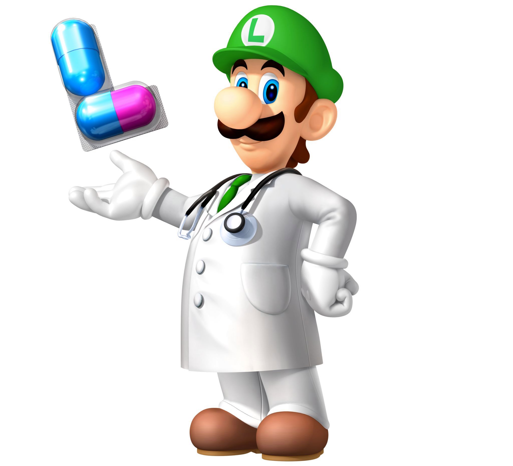
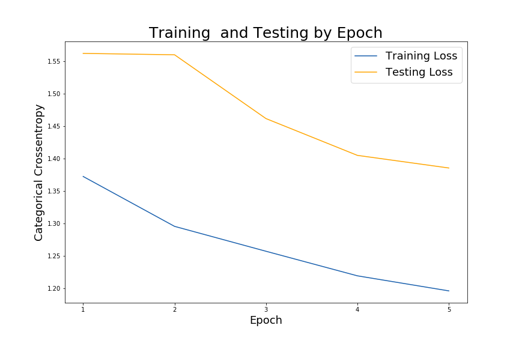

# Medication Adherence using a Convolution Neural Network

## Table of Contents

- [01. What's In This Repository Anyway?](*01.-What's-In-This-Repository-Anyway?)
- [02. And Now, Some Backstory...](#02.-And-Now,-Some-Backstory...)
- [03. Executive Summary](#03.-Executive-Summary)
    - [A. Download Setup](#A.-Download-Setup)
    - [B. Downloading Images](#B.-Downloading-Images)
    - [C. Image Preprocessing](#C.-Image-Preprocessing)
    - [D. Using a CNN](#D.-Using-a-CNN)
- [04. Conclusion and Next Steps](#04.-Conclusion-and-Next-Steps)
- [05. Sources and References](#05.-Sources-and-References)

### 01. What's In This Repository Anyway?

- `code`: folder for all created code notebooks (4 in total).  Each notebook runs a specific aspect of the overall project, due to the large size of the notebook if they were combined into one.

- `data`: folder that contains all necessary data for operating the code notebooks.  The two directories have been downloaded from the National Library of Medicine as xlsx files.  The rest are generated from the code notebooks.

- `images`:  Due to the massive size (99GB) of the combined image set (both reference and consumer-grade), we will not have any of the pill images on this repository, despite the folders.  You are welcomed to download the respective image sets via the link located in the ***[Sources and References](#Sources-and-References)*** section.

- `README`: The documentation that you are currently reading.

### And Now, Some Backstory...

My mother underwent a kidney transplant in the Summer of 2019.  In the following months, things became complicated and she was in and out of the hospital on an almost weekly basis.  As a results of these complications and extra surgery, there are numerous medications she now has to manage.  As of this writing, we have switched out medications on an almost weekly basis, while, thankfully, reducing the total amount of pills, capsules, and injections from over 20 down to 14.  Constantly having to set up her pill box is time consuming and tiring, as you have to account for the changes in medications and ensure its accurate administration. Adhering to this system is draining and she is not alone in this.  2/3rd of people in the United States have prescriptions, and only half take their medications as directed.  This is known as medication nonadherence and it costs the U.S. roughly 289 billion dollars annually, accounting for 10% of all hospitalizations.

What if we could reduce the amount of unnecessary hospitalization?  How about decreasing the 125,000 annual deaths associated with medication nonadherence?  What if patients had a way to better adhere to their medication routines?  Enter Dr. Luigi.

*After years of living in Mario's shadow, Luigi went to med school and became a doctor.*

Dr. Luigi is the name given to the convolutional neural network (CNN) being built out for this project.  Since medications come in various shapes, sizes, colors and imprints, things can quickly become confusing for a patient, especially if there are numerous medications to keep track of.  The idea is to properly identify pills in order account for accurate, correct dosages for a patient.  We will build out a CNN for this task.  CNNs are ideal as they are used in object detection and identification in images and videos.  To gauge the successful identification of the medications, we will look at the relationship between the model's loss and accuracy.

### Executive Summary

We want to end up with trained convolutional neural network that can identify the different kinds of medications images that it looks at.  For this, we need to train it on a large collection of medication images and afterwards, test it out its accuracy.  Given these parameters, we went through the following steps.

#### A. Download Setup
The U.S. National Library of Medicine has a collection of pill images as part of a project that was discontinued in 2018. This collection consisted of over 137,000 pill images, split between reference pill images and consumer-grade pill images.

While the 4,000+ reference pill images were easy to obtain as a downloadable 6.8GB zip file, the consumer-grade pill images were not.  Those images were stored on an FTP site and could only be downloaded one-by-one.  This process leveraged the respective consumer-grade image in order to properly create a .csv file that would be used in the next step to download 133,000+ consumer-grade images, which we would use as our test set.

#### B. Downloading Images
This step leverages the results of the previous step in order to pull all consumer-grad images from the U.S. National Library of Medicine's FTP site by utilizing the `webbrowser` library.  The total run-time for this step was just over 66 hours, as we are essentially scraping the web for file and built in a `sleep` step into our function to avoid any issues.

#### C. Image Preprocessing
Here we set up both reference and consumer images for neural network processing. 
 Since we are training our model with categorical data, we need to create folders for each medication (our categories). Then we move on to converting each image into arrays that the neural network can interpret. We end the step by saving down all image arrays into pickled files that can be opened (without issues) into the CNN in the next step.

The majority of the challenges stemmed from this step and the next as well.  In this step, challenges came from properly organizing each medication with their respective images.  The reason this was such a challenge was due to the naming convention provided by the NLM directories.  Although, they have not been 100% addressed, due to lack of time, they have been identified and will be addressed down the line.

#### D. Using a CNN
After preprocessing our data this final step builds the CNN. The model itself will consist of several layers that consists of the feature learning layers (convolutional, pooling) and the classification layers (densely connected, output) and an output layer.

This step, as the previous one before it, gave us some issues.  Our computer would run out of memory once the model started to run - implying that we gave it too much data.  We fixed  this by significantly reducing the size of the input data, so we can get it to run.  Once the model was running, due to the low amount of data, return less than stellar results.  This can be fixed by finding a middle ground between too much and too little data.

### 04. Conclusion and Next Steps

We were unsuccessful in using the consumer-grade images as our testing data (due to improper setups).  This, combined with a large training dataset gave us setbacks in building a viable model.  This gave us the below results for our model's 'best' parameters:

As a note, these issues are identifiable and addressable.  Given more time, we can address the issues below:

- **Medication Names:** By far, the largest pain point is how the medications have been named by the NLM.  There are multiple names for the same prescription / dosage / shape combination, whereby some also have the generic name attached.  Further investigation is needed, but we hypothesize that by addressing this issue (possibly by consolidation), we can reduce the actual amount of medication classifications, which in-turn, leads to less time needed to train our model and a higher accuracy score with less loss.

- **Converting Images:** We can attempt to use higher resolution images to train a better model.  We need to be mindful to not feed it images with too high of a resolution, as we want to avoid overfitting.
 
- **Images:** To put it simply, we need to increase the amount of images that we feed into the model.  Neural networks in general are built for large datasets and fall flat with smaller datasets, like the one that we gave it (in order to avoid running out of memory).

- **Score:** Overall, we need to focus on, not only surpassing the baseline score, but also increasing the accuracy score over 90% (taking into consideration the loss function).  Once we achieve that score we can move forward with the next iteration of Dr. Luigi.

After addressing these issues, we would ideally like to further leverage the `OpenCV` library to implement our model onto live video feeds of prescriptions and test its identification.  This would help us in better analyzing the interaction between Dr.Luigi and a patient when it comes to medication adherence.

### 05. Sources and References

 - [National Library of Medicine](https://www.nlm.nih.gov/databases/download/pill_image.html)
